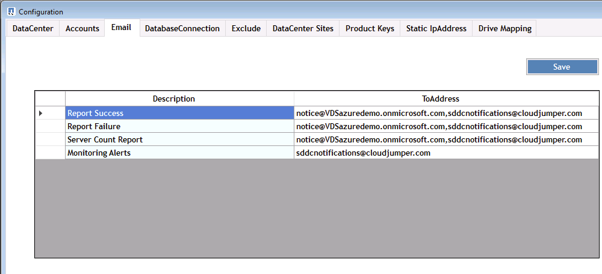
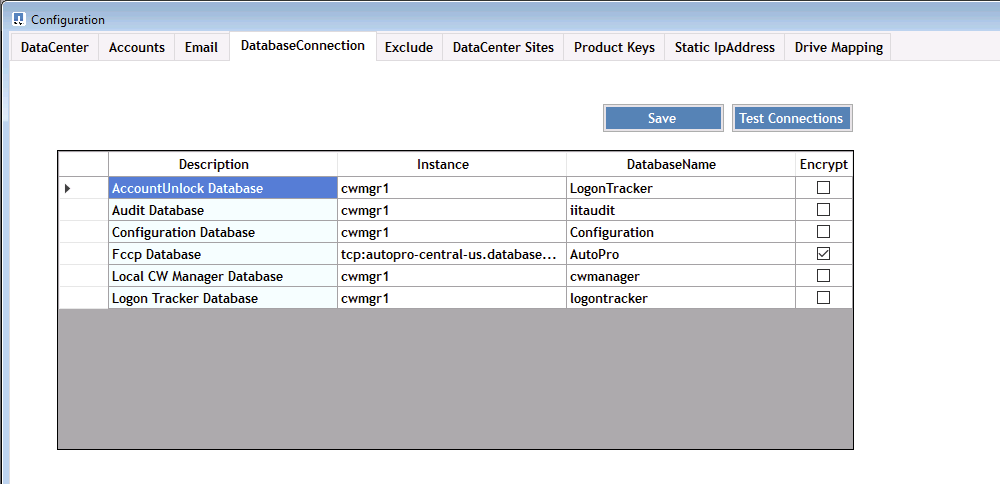

= Présentation
:allow-uri-read: 

== Présentation

DCConfig est un utilitaire de configuration de la machine virtuelle CWMGER1 utilisé pour définir et modifier de nombreux paramètres de déploiement.

. Connectez-vous à la machine virtuelle CWMGER1 en tant qu'administrateur
. Exécutez l'application à partir du raccourci du bureau

L'application comporte trois sections principales : Configuration, Avancé et aide.

=== Configurations

La fenêtre configurations s'ouvre au lancement et comporte plusieurs sous-sections

==== Data Center

image::images/Management.dcconfig.dcconfig.overview-61c8f.png[Management.dcconfig.dcconfig.overview 61c8f]

==== Comptes

image::images/Management.dcconfig.dcconfig.overview-f34a2.png[Management.dcconfig.dcconfig.overview f34a2]

==== E-mail

==== Connexion DatabaseConnection

==== Exclure

image::images/Management.dcconfig.dcconfig.overview-0f30e.png[Management.dcconfig.dcconfig.overview 0f30e]

==== Sites de data centers

==== Clés de produit

image::images/Management.dcconfig.dcconfig.overview-298a0.png[Management.dcconfig.dcconfig.overview 298a0]

==== Adresse IP statique

image::images/Management.dcconfig.dcconfig.overview-7e4a4.png[Management.dcconfig.dcconfig.overview 7e4a4]

==== Mappage de lecteur

image::images/Management.dcconfig.dcconfig.overview-60fd2.png[Management.dcconfig.dcconfig.overview 60fd2]

=== Avancé

La fenêtre Avancé affiche une liste de valeurs qui peuvent être modifiées à partir de cette interface.

[cols="33,33,33"]
|===
| Nom de groupe | FriendlyName | Valeur 

| Nom de groupe | FriendlyName | Valeur 

| Création de serveur | UpdateVMNameWhenRemovedFromCache | Vrai/faux 

| Création de serveur | UpdateFireswallRules | Vrai/faux 

| Création de serveur | WaitAfterRebootmin | <# minutes> 

| Création de serveur | WaitAfterHypervisorCreatemin | <# minutes> 

| Création de serveur | WaitAfterSysPprépmin | <# minutes> 

| Création de serveur | WaitAfterSysPrepFor2008Serversmin | <# minutes> 

| Création de serveur | Chemin d'accès de GFI Agent |  

| Création de serveur | Clonage automatisé activé | Vrai/faux 

| Création de serveur | CompaniesOU | <String - Companines ou Name> 

| Création de serveur | Installez ThinPrint v11 | Vrai/faux 

| Création de serveur | ServersOU | <chaîne - Nom ou serveur> 

| Création de serveur | Installer FsLogix | Vrai/faux 

| Création de serveur | Utiliser les UO par défaut | Vrai/faux 

| Création de serveur | Nombre maximum de threads | <#> 

| Création de serveur | Attendez que DNS ait mis à jour les minutes | <# minutes> 

| Vérifier la version des outils V c.c. | Exécuter toutes les X minutes | <# minutes> 

| Actions quotidiennes | Activé | Vrai/faux 

| Actions quotidiennes | Exécuter au démarrage | Vrai/faux 

| Générer des rapports | Heure du jour | <HEURE 00:00> 

| Entretien quotidien | Activé | Vrai/faux 

| Entretien quotidien | Heure du jour | <HEURE 00:00> 

| Entretien hebdomadaire | Activé | Vrai/faux 

| Entretien hebdomadaire | Heure du jour | <HEURE 00:00> 

| Entretien hebdomadaire | Jour | <jour de la semaine> 

| AutomaticResourceallocation | Activé | Vrai/faux 

| Allocation de ressources | Utiliser les valeurs par défaut du centre de données | Vrai/faux 

| Rapports EmailReports | Inclut | Vrai/faux 

| Server Heartbeat | Intervalle minutes | <# minutes> 

| Télécharger AutoPro Data | Intervalle minutes | <# minutes> 

| Pulsation datacenter | Intervalle minutes | <# minutes> 

| Le serveur redémarre | Activé | Vrai/faux 

| Le serveur redémarre | Délai entre les redémarrages minutes | <# minutes> 

| Rapport FreeSpaceReport | MinFreeSpaceGB | <# Go seuil minimum> 

| MaxRebootTimeSpanhours | Serveurs clients | <# heures avant le redémarrage requis> 

| MaxRebootTimeSpanhours | InfrastructureServers | <# heures avant le redémarrage requis> 

| Mettre à jour automatiquement les outils VDC | Activé | Vrai/faux 

| ActivateOffice | Activé | Vrai/faux 

| ActivateWindows | Activé | Vrai/faux 

| Contrôle | Jours de rétention max | <# jours> 

| Journaux | Jours de rétention max | <# jours> 

| Données de rapport | Jours de rétention max | <# jours> 

| Audit de fichiers | Jours de rétention max | <# jours> 

| Audit de fichiers | Journalisation détaillée | Vrai/faux 

| Dossiers FileAuditFolders | Dossiers numériques | 2 

| FileAuditFolder1 | Chemin | [DataDrive]:\Data 

| FileAuditFolder1 | Exclure | *Thumbs.db 

| FileAuditFolder1 | Exclure | *.tmp 

| FileAuditFolder1 | Exclure | *~$*.doc 

| FileAuditFolder1 | Exclure | *~$*.docx 

| FileAuditFolder2 | Chemin | [DataDrive]:\Home 

| FileAuditFolder2 | Exclure | Pouces.db 

| CwVmAutomationService | Arguments de ligne de commande de service |  

| FtpReleaaeAddress | URL | <URL FTP> 

| Planification de la charge de travail | Exécuter toutes les X minutes | <# minutes> 

| Planification de la charge de travail | Désactivez les sociétés de cache | Vrai/faux 

| Création de sauvegardes | Activé | Vrai/faux 

| Création de sauvegardes | Exécuter toutes les X minutes | <# minutes> 

| Surveiller les applications | Activé | Vrai/faux 

| STYLET | InitialSleepSedeuxièmement | <# secondes> 

| STYLET | MustChangePasswordDay | <# jours avant l'expiration pour la réinitialisation forcée PW> 

|  |  | <chaîne de texte de réinitialisation du mot de passe> 

| STYLET | Logo | <chemin du logo local .png> 

| STYLET | NONtifyDays | <# jours> 

| STYLET | Notification 1 | <# jours avant l'expiration de la notification> 

| STYLET | Notification.jour 2 | <# jours avant l'expiration de la notification> 

| STYLET | Notification.jour 3 | <# jours avant l'expiration de la notification> 

| STYLET | Notification.Day4 | <# jours avant l'expiration de la notification> 

| STYLET | Notification dification5 | <# jours avant l'expiration de la notification> 

| STYLET | Notification.jour 6 | <# jours avant l'expiration de la notification> 

| Contrôle | Activé | Vrai/faux 

| Contrôle | Envoyer des alertes par e-mail | Vrai/faux 

| Contrôle | Serveur d'alerte en panne pendant quelques minutes | <# minutes> 

| Contrôle | RAM d'alerte élevée pendant quelques minutes | <# minutes> 

| Contrôle | RAM haute % | <seuil de RAM %> 

| Contrôle | Alerte CPU haut pendant quelques minutes | <# minutes> 

| Contrôle | CPU haut % | <seuil du processeur %> 

| Contrôle | Pourcentage faible d'espace disque | <seuil de % d'espace libre sur le disque> 

| Supprimer le délai client | Quelques minutes | <# minutes> 

| Développez le lecteur automatiquement | Activé | Vrai/faux 

| Renforcement de la sécurité | Activé | Vrai/faux 

| Exécutez CwAgent en tant qu'administrateur de domaine | Activé | Vrai/faux 

| Surveiller les serveurs | Utilisation de SolarWinds | Vrai/faux 

| Mise à jour automatique du portail H5 | Activé | Vrai/faux 

| Installez le cert. Générique | Sur serveurs d'infrastructure | Vrai/faux 

| Création de société | Dans un site unique | Vrai/faux 

| Mise à l'échelle dynamique | Délai Arrêt min | <# minutes> 

| Rapport de ressources de serveur | Vérifiez DNS | Vrai/faux 

| Hyperviseur | Modèles de cache | Vrai/faux 

| Journalisation détaillée | Mise à l'échelle dynamique | Vrai/faux 

| Journalisation détaillée | Live Scaling-Show Server Status | Vrai/faux 

| Journalisation détaillée | Planification des charges de travail | Vrai/faux 

| Journalisation détaillée | Créer un serveur à partir d'un modèle | Vrai/faux 

| Journalisation détaillée | Créer un serveur à partir d'un modèle de synchronisation | Vrai/faux 

| Journalisation détaillée | Créer un serveur à partir de la sauvegarde | Vrai/faux 

| Journalisation détaillée | Créer un serveur à partir du clone | Vrai/faux 

| Journalisation détaillée | Créer un modèle | Vrai/faux 

| Journalisation détaillée | Communiquer avec d'autres Services | Vrai/faux 

| Créer un modèle | RunSysPrep manuellement | Vrai/faux 

| Contrôleur de domaine | Nom | cwmgr1.<domain.com> 
|===
image::images/Management.dcconfig.dcconfig.overview-9c7ac.png[Management.dcconfig.dcconfig.overview 9c7ac]

=== Aide

Ouvre le fichier d'aide local.
